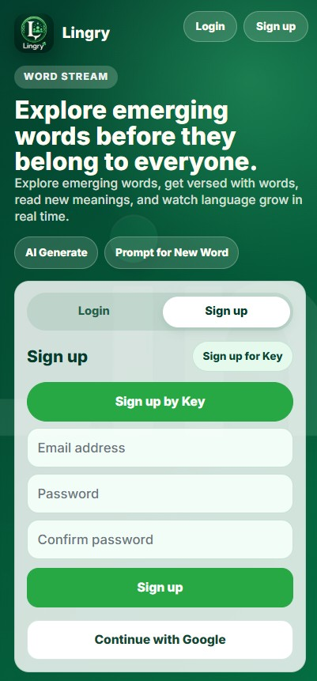
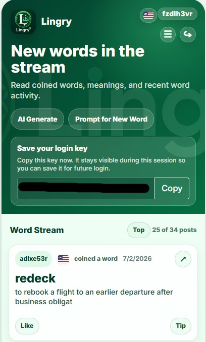
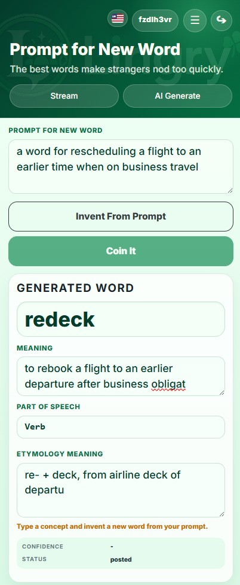
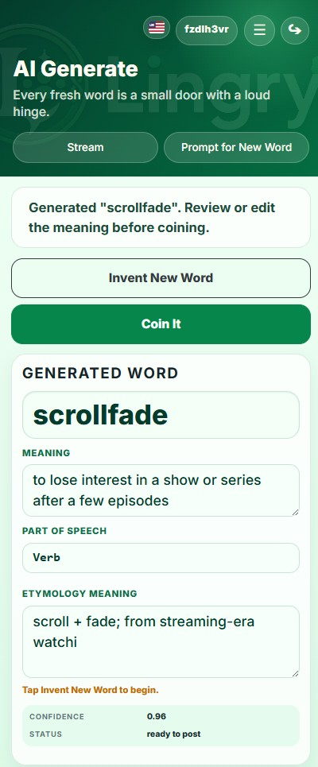
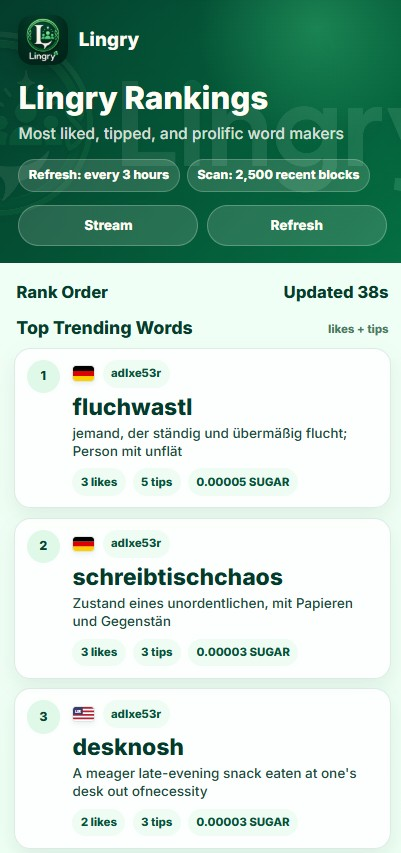
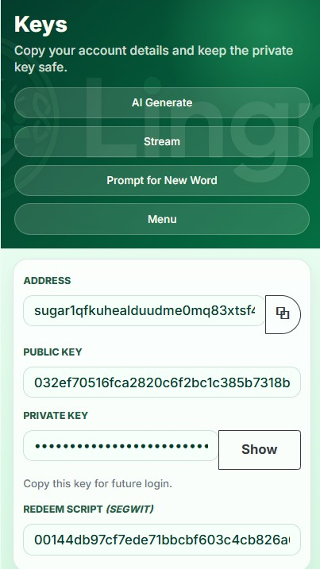
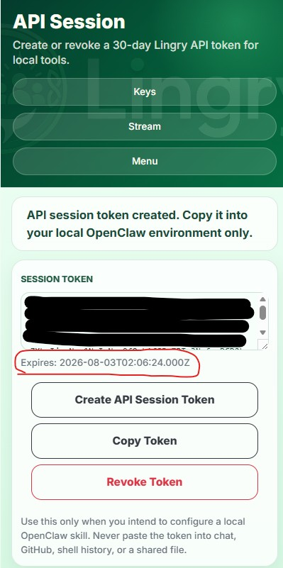
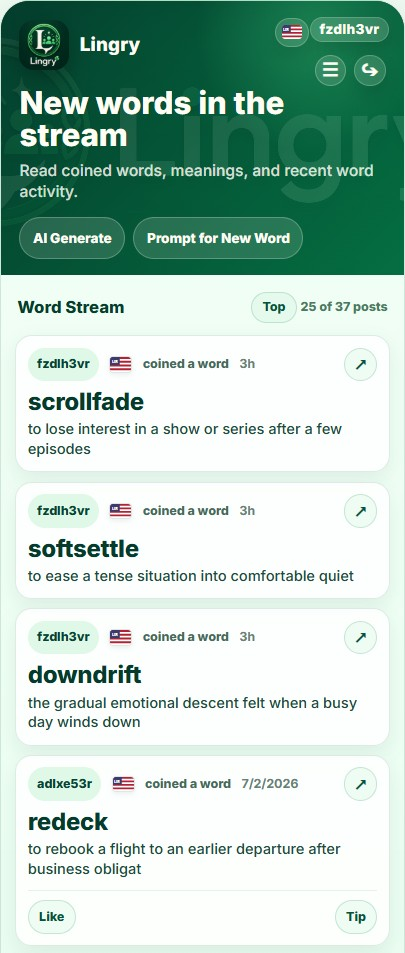
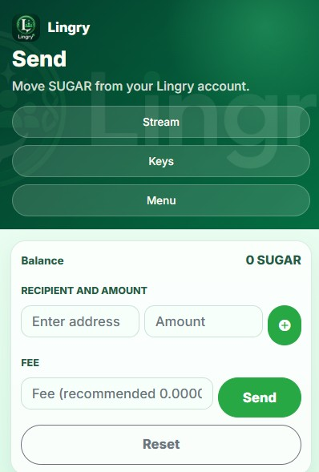

# Lingry Screenshot Guide

This guide is the GitHub-hosted visual documentation source for Lingry screenshots. It is safe to include relative image links here because this file is viewed in the repository, not inside the published ClawHub skill bundle.

Use the intake script to add one screenshot at a time:

```bash
python3 scripts/add_lingry_screenshot.py
```

## Table of contents

- [Screenshot intake rules](#screenshot-intake-rules)
- [Planned walkthrough sections](#planned-walkthrough-sections)
- [Screenshot index](#screenshot-index)
- [1. Legacy account form (archived)](#1-legacy-account-form-archived)
- [2. Legacy key-backup screen (archived)](#2-legacy-key-backup-screen-archived)
- [3. Prompt for a new word](#3-prompt-for-a-new-word)
- [4. Generate a word with AI](#4-generate-a-word-with-ai)
- [5. View Lingry rankings](#5-view-lingry-rankings)
- [6. View wallet keys from the menu](#6-view-wallet-keys-from-the-menu)
- [7. Create an API session token for OpenClaw](#7-create-an-api-session-token-for-openclaw)
- [8. Browse the Lingry word stream](#8-browse-the-lingry-word-stream)
- [9. Send Sugars from the menu](#9-send-sugars-from-the-menu)

## Screenshot intake rules

Only add screenshots that have been reviewed for secrets and personal information. Do not add private keys, seed phrases, recovery phrases, wallet passphrases, session tokens, API keys, email addresses, phone numbers, personal names, browser autofill details, sensitive balances, sensitive transaction records, or terminal history containing credentials.

The published ClawHub skill package must stay text-only. Screenshots belong in this `docs/lingry/screenshots/` directory and are referenced from `openclaw/skills/lingry/SKILL.md` only after they are committed to GitHub and synced with commit-pinned raw GitHub URLs.

## Planned walkthrough sections

1. Lingry homepage
2. Open Lingry with the wallet-first entry flow
3. Creating a word
4. Coining or submitting a word
5. Viewing the Stream
6. Viewing the Leaderboard
7. Connecting or using a wallet
8. Using the Lingry OpenClaw skill

## Screenshot index

## 1. Legacy account form (archived)

> This screenshot documents the retired account form. Current Lingry onboarding uses **Start New** or **I already have Lingry**, followed by a local 4-digit device PIN. Do not direct users through the form pictured below.



**What the screenshot shows:** The Lingry home screen is open with the Sign up tab selected. The form shows email address, password, and confirm password fields, plus Sign up, Continue with Google, and Sign up by Key options.

**Why this step matters:** This is the main account-creation entry point and shows that users can choose either the standard email/password flow or the wallet-key path.

**Exact user action:** Enter an email address, create a password, confirm the password, then select Sign up. Users who prefer wallet-key access can select Sign up by Key instead.

**Expected result:** Lingry creates the wallet session and brings the user into the app.

**Relevant Lingry or OpenClaw command:** Not applicable.

**Agent guidance:** Guide the user to choose the normal email sign-up path unless they specifically want wallet-key access. Never ask the user to paste a private key, password, or session token into chat.

Paired documentation: [`01-sign-up-from-the-lingry-home-screen.md`](./01-sign-up-from-the-lingry-home-screen.md)

## 2. Legacy key-backup screen (archived)

> Current Lingry calls this the **Lingry Private Key** and presents it before 4-digit device-PIN setup. The image below is retained only as historical UI documentation.



**What the screenshot shows:** The Lingry app shows a Save your login key panel near the top of the Word Stream. The login key field is present, the key value is redacted in this documentation screenshot, and a Copy button is available.

**Why this step matters:** This is the user's recovery and future-login credential, so it must be saved privately before they move on.

**Exact user action:** Copy the login key and save it somewhere secure before continuing in Lingry.

**Expected result:** The user has a saved login key they can use to access the wallet again later.

**Relevant Lingry or OpenClaw command:** Not applicable.

**Agent guidance:** Explain that this key must be treated like a wallet credential. Tell the user to save it privately and never paste it into chat, public docs, issue comments, or screenshots.

Paired documentation: [`02-save-your-login-key.md`](./02-save-your-login-key.md)

## 3. Prompt for a new word



**What the screenshot shows:** The Prompt for New Word screen shows a text area containing a concept prompt, an Invent From Prompt button, a Coin It button, and a Generated Word panel with editable word, meaning, part of speech, etymology meaning, confidence, and status fields.

**Why this step matters:** This is where the user turns a plain-language concept into a focused Lingry word candidate before deciding whether it is worth coining.

**Exact user action:** Type a concept or idea into the Prompt for New Word field, then select Invent From Prompt.

**Expected result:** Lingry generates a suggested word with meaning, part of speech, etymology meaning, confidence, and status details.

**Relevant Lingry or OpenClaw command:** Not applicable.

**Agent guidance:** Help the user phrase the prompt clearly and specifically, then review the generated word details before recommending any coining or submission step.

Paired documentation: [`03-prompt-for-a-new-word.md`](./03-prompt-for-a-new-word.md)

## 4. Generate a word with AI



**What the screenshot shows:** The AI Generate screen shows a generated word candidate, the Invent New Word and Coin It buttons, editable meaning and etymology fields, part of speech, confidence, and ready-to-post status.

**Why this step matters:** This gives users a fast path from opening Lingry to reviewing a coinable word candidate without having to write a prompt first.

**Exact user action:** Open AI Generate and select Invent New Word to create a fresh word suggestion, then review or edit the generated details before selecting Coin It.

**Expected result:** Lingry shows a generated word candidate with meaning, part of speech, etymology meaning, confidence, and ready-to-post status.

**Relevant Lingry or OpenClaw command:** Not applicable.

**Agent guidance:** Use this screen when the user wants a quick generated candidate. Encourage them to review and edit the meaning before preparing any coining request.

Paired documentation: [`04-generate-a-word-with-ai.md`](./04-generate-a-word-with-ai.md)

## 5. View Lingry rankings



**What the screenshot shows:** The Lingry Rankings page shows refresh and scan information, a Stream button, a Refresh button, and Top Trending Words cards with rank numbers, language flags, creator handles, definitions, likes, tips, and Sugar totals.

**Why this step matters:** Rankings help users find active words and creators, then decide which contributions to support with likes or Sugar tips.

**Exact user action:** Open Lingry Rankings, review the top trending words, then use like or tip actions when a word contribution is worth supporting.

**Expected result:** The user sees ranked words and creator activity ordered by likes and tips, with the latest refresh and scan context visible.

**Relevant Lingry or OpenClaw command:** Not applicable.

**Agent guidance:** Use rankings to help the user discover popular words and creators. Explain that likes and tips are public contribution signals, and never claim a tip succeeded until the wallet/API confirms it.

Paired documentation: [`05-view-lingry-rankings.md`](./05-view-lingry-rankings.md)

## 6. View wallet keys from the menu



**What the screenshot shows:** The Keys screen shows account details, including the wallet address, public key, a private key field that remains masked in this documentation screenshot, a Show button, and redeem script information.

**Why this step matters:** This is where users can recover the credential needed for future wallet access, so it must be handled privately and stored securely.

**Exact user action:** Open Menu, choose Show Keys, and only reveal or copy the private key when the user is in a private setting ready to store it securely.

**Expected result:** Lingry shows the wallet address, public key, masked private key field, and related wallet details so the user can save access information safely.

**Relevant Lingry or OpenClaw command:** Not applicable.

**Agent guidance:** Warn the user that the private key controls wallet access. Never ask them to paste it into chat, screenshots, GitHub, ClawHub, logs, or support messages.

Paired documentation: [`06-view-wallet-keys-from-the-menu.md`](./06-view-wallet-keys-from-the-menu.md)

## 7. Create an API session token for OpenClaw



**What the screenshot shows:** The API Session screen shows a redacted session-token field, an expiration timestamp, and Create API Session Token, Copy Token, and Revoke Token buttons. The page warns users to use the token only for a local OpenClaw skill and never paste it into chat, GitHub, shell history, or shared files.

**Why this step matters:** This connects Lingry browser authentication to local OpenClaw tooling without exposing the token to the agent. The expiration date tells the user when to refresh the token.

**Exact user action:** Open Menu, choose API Session, create an API session token, copy it, and paste it only into the local OpenClaw environment file.

**Expected result:** The local OpenClaw tools can authenticate to Lingry until the displayed token expiration date, after which the user refreshes the token from the same screen.

**Relevant Lingry or OpenClaw command:** Use the private terminal snippet in the paired screenshot documentation to write LINGRY_SESSION_TOKEN into $HOME/.openclaw/.env with 0600 permissions, then restart the OpenClaw gateway.

**Agent guidance:** Guide OpenClaw users to store the token only in their private local environment. Never ask them to paste the token into chat, GitHub, screenshots, shell history, logs, or shared files.

Paired documentation: [`07-create-an-api-session-token-for-openclaw.md`](./07-create-an-api-session-token-for-openclaw.md)

## 8. Browse the Lingry word stream



**What the screenshot shows:** The Word Stream shows a list of recent coined word cards with creator handles, language flags, timestamps, word names, meanings, Like and Tip controls, plus navigation to AI Generate and Prompt for New Word.

**Why this step matters:** This is the main discovery surface for community word activity and gives users a place to read, open, like, and tip public contributions.

**Exact user action:** Open the Stream tab and scroll through the word cards to read new words, meanings, creators, and timestamps. Use Like or Tip when a contribution is worth supporting.

**Expected result:** The user sees recent Lingry words and can open, like, or tip public word contributions.

**Relevant Lingry or OpenClaw command:** Not applicable.

**Agent guidance:** Use the Stream to help users discover recent word activity and explain meanings. Do not describe OpenClaw stream data as live or real-time; public agent reads use the latest completed snapshot.

Paired documentation: [`08-browse-the-lingry-word-stream.md`](./08-browse-the-lingry-word-stream.md)

## 9. Send Sugars from the menu



**What the screenshot shows:** The Send screen shows the current Sugar balance, recipient address and amount inputs, a fee input with recommended-fee placeholder text, a Send button, and a Reset button.

**Why this step matters:** This is the point where a user prepares an actual wallet transfer, so the recipient, amount, and fee must be reviewed carefully before submission.

**Exact user action:** Open Menu, choose Send, enter the recipient wallet address, enter the Sugar amount and fee, then select Send only after reviewing the details.

**Expected result:** Lingry prepares the wallet transfer flow so the user can confirm and submit a Sugar transaction to the chosen recipient.

**Relevant Lingry or OpenClaw command:** Not applicable.

**Agent guidance:** Help the user verify the recipient address, amount, and fee before sending. Never invent transaction status or claim a transfer succeeded until Lingry or the wallet confirms it.

Paired documentation: [`09-send-sugars-from-the-menu.md`](./09-send-sugars-from-the-menu.md)
